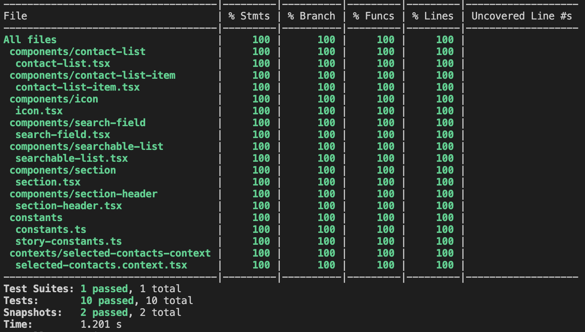

# Storybook featuring the Searchable List Component.

This is a basic Create React App templated React app with Storybook. This was created for to fulfill the requirements of an interview challenge.

This uses Typescript, React, Styled components, Jest and Storybook per the parameters of the challenge.

## Caveats and other improvements desired for real world applications:

Currently there is no tooling installed locally to build and export the package as a component library. This wouldn't matter if the goal was to only use the components locally in the same repo. This was avoided as the challenge didn't require it.

The theming via Styled Components could be drastically improved. I used very basic constant variables for some shared colouring, however ideally these and many other shared variables (layouts, colors, borders, etc) would be a part of a larger application theme. This would reduce code duplication and be much easier to integrate into individual components.

Tests are limited only to the `searchable-list` component, as the challenge was focusing on that. However the test coverage is 100%. Ideally the tests would also be included on the other components, and utils. E2E tests (Cypress or Playwright) would ideally be added when the need arises for testing the entire stack.

## Code coverage

## Installing and running the application

This assumes you have Node installed locally. The node version used for development was 10.7.0, I would suggest having at least that version.

In the project directory, you can run:

### `npm i`

This will install the projects dependencies locally.

### `npm run storybook`

This will launch Storybook locally and you will be able to view and interact with the component's stories.

### `npm run test`

This will run all the Jest tests in watch mode and display the code coverage results. Currently there is 100% code coverage. Though this does not mean the tests couldn't be improved. Ideally the tests would also cover the individual components and not only the `searchable-list` component. The format also could be improved, as well as testing specific functionalities in combination with each other.

